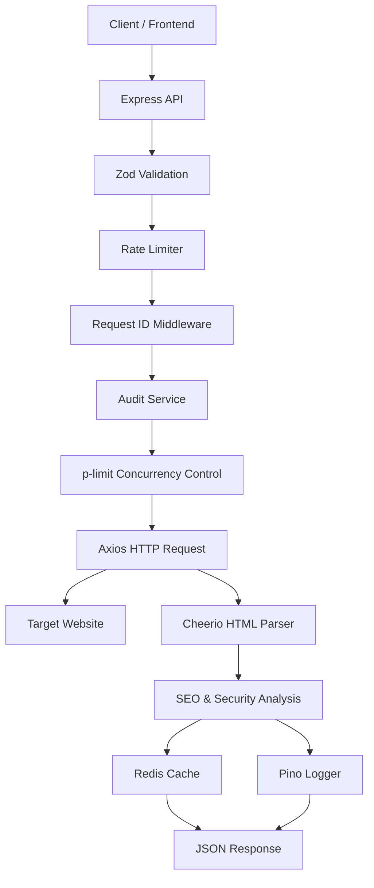

# Architecture Document – PagePulse URL Audit Service

## 1. System Overview

The PagePulse URL Audit Service is a production-oriented REST API built using Express.js and TypeScript. It audits web pages by fetching their HTML content, extracting SEO and security information, measuring performance metrics, and returning a structured JSON report.

The application is designed to handle concurrent audit requests efficiently while maintaining reliability through request validation, rate limiting, caching, structured logging, and configurable timeouts.

The architecture follows a modular design, separating routing, middleware, business logic, configuration, and caching into independent components. This improves maintainability, scalability, and testability.

The system also supports containerized deployment using Docker and includes automated testing using Jest.

## 2. High-Level Architecture

## 3. Request Flow

1. A client sends a URL audit request to the Express API.
2. The request is validated using Zod to ensure the URL format is correct.
3. Express Rate Limit checks whether the client has exceeded the allowed request limit.
4. The Audit Service checks Redis for a cached audit result.
5. If a cached result exists, it is returned immediately.
6. If no cached result exists, the request enters the concurrency limiter (p-limit).
7. Axios fetches the target webpage with a configurable timeout.
8. Cheerio parses the HTML content to extract SEO information such as the title, meta description, canonical URL, Open Graph tags, and H1 count.
9. Security headers and performance metrics are collected.
10. The completed audit is stored in Redis for future requests.
11. Pino logs the request and audit details.
12. The API returns a structured JSON response to the client.

## 4. Component Description

### Express API
Acts as the entry point for all client requests. It exposes REST endpoints, applies middleware, and forwards validated requests to the Audit Service.

### Zod Validation
Validates incoming request data, ensuring only correctly formatted URLs are processed and preventing invalid input from reaching the business logic.

### Express Rate Limiter
Protects the API against abuse by restricting the number of requests that a client can make within a defined time window.

### Audit Service
The core business component responsible for coordinating URL fetching, HTML parsing, SEO extraction, performance measurement, and security analysis.

### Axios
Performs HTTP requests to the target website with configurable timeout and redirect handling.

### Cheerio
Parses the downloaded HTML document and extracts SEO-related information such as page title, meta description, H1 count, canonical URL, and Open Graph metadata.

### Redis Cache
Stores previously generated audit reports to reduce duplicate requests, improve response time, and reduce unnecessary network traffic.

### Pino Logger
Generates structured logs for debugging, monitoring, and production observability.

### Docker
Docker and Docker Compose provide a consistent environment for local development, testing, and deployment.

## 5. Technology Decision Record

| Technology | Purpose | Reason for Selection |
|------------|---------|----------------------|
| Express.js | REST API Framework | Lightweight, mature, and has a rich middleware ecosystem. |
| TypeScript | Type Safety | Improves code reliability by detecting errors during development. |
| Axios | HTTP Client | Supports configurable timeout, redirects, and simplified HTTP requests. |
| Cheerio | HTML Parsing | Efficiently extracts SEO information without requiring a browser. |
| Redis | Caching | Reduces duplicate audits and improves response time. |
| Pino | Logging | High-performance structured logging suitable for production systems. |
| Zod | Request Validation | Ensures incoming data is validated before processing. |
| express-rate-limit | Rate Limiting | Prevents abuse and protects API resources. |
| p-limit | Concurrency Control | Restricts simultaneous audit operations to avoid server overload. |
| Docker | Containerization | Provides a portable and reproducible deployment environment. |

## 6. Failure Mode Analysis

| Failure Scenario | Impact | Mitigation |
|------------------|--------|------------|
| Target website timeout | Audit cannot complete | Configure Axios timeout and return an appropriate timeout response. |
| Invalid or malformed URL | Request fails | Validate all URLs using Zod before processing. |
| High request volume | Increased server load | Apply rate limiting and concurrency control using express-rate-limit and p-limit. |
| Redis unavailable | Cache cannot be accessed | Continue processing requests without cache and log the failure. |
| Target website returns non-HTML content | SEO analysis impossible | Detect content type and return a meaningful error response. |

## 7. Observability and Monitoring

The application uses Pino for structured logging to capture request details, errors, and execution information.

Key metrics that should be monitored include:

- API response time
- Error rate
- Cache hit ratio
- Number of concurrent audits
- CPU usage
- Memory usage

Recommended alerts:

- Response time exceeds 2 seconds
- Error rate exceeds 5%
- Memory usage exceeds 80%
- Redis becomes unavailable

## 8. Deployment and Rollback Strategy

The application supports containerized deployment using Docker and Docker Compose to ensure consistent environments across development and production.

Deployment process:

1. Build the Docker image.
2. Start services using Docker Compose.
3. Verify application health.
4. Monitor logs after deployment.

Rollback strategy:

- Stop the faulty deployment.
- Restart the previous stable container image.
- Verify application health.
- Resume normal traffic after successful validation.

## 9. Scalability Considerations

The application is designed with scalability in mind through:

- Redis caching to reduce repeated processing.
- Concurrency control using p-limit.
- API rate limiting to prevent overload.
- Modular architecture for easier maintenance.
- Docker-based deployment for consistent scaling.
- Horizontal scaling by running multiple API instances behind a load balancer.

## 10. AI Usage Statement

AI tools, including Gemini and ChatGPT, were used during development to assist with brainstorming, code generation, debugging, and documentation. All generated content was reviewed, tested, modified where necessary, and validated through local execution, testing, and manual verification to ensure it accurately reflects the implemented solution.